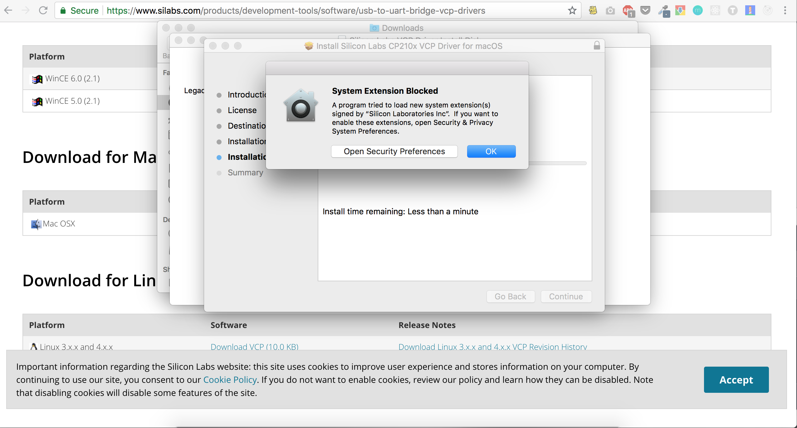
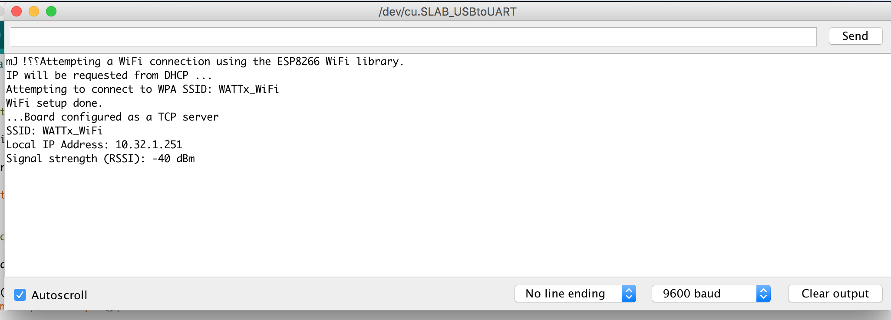

# Setup your machine for the workshop!
Setup your computer for Wemos, GoBOT & Docker

## Step 1: Driver
Download driver from wemos website and install it.
* URL: [https://www.silabs.com/products/development-tools/software/usb-to-uart-bridge-vcp-drivers](https://www.silabs.com/products/development-tools/software/usb-to-uart-bridge-vcp-drivers)
* Caution: You will need to enable driver while installing it.



## Step 2: Arduino IDE
Download IDE from Arduino website and install it.
* URL: [https://www.arduino.cc/en/Main/Software](https://www.arduino.cc/en/Main/Software)


## Step 3: Make Ardiuo IDE support WeMos
* Start Arduino and open Preferences window.
* Enter `http://arduino.esp8266.com/stable/package_esp8266com_index.json` into Additional Board Manager URLs field. You can add multiple URLs, separating them with commas.


* Go to Tools -> Board: "Arduino..." -> Board Managers and install `esp8266 by ESP8266 Community`

   
* From Tools -> Board: "Arduino..." -> select the `WeMos D1 R2 & Mini`

* Connect the WeMos to your PC and under Tools -> Port select `/dev/cu.SLAB_USBtoUART`


## Step 4: Network support for WeMos
* If you are using Arduino IDE version 1.6.4 or higher go to `Sketch > Include Library > Manage Libraries` and then search for "ConfigurableFirmata" and click on `Install` after tapping on the ConfigurableFirmata item in the filtered results. You can also use this same method to update ConfigurableFirmata in the future.

* Open file `./firmata/firmata.ino` from Ardiuo IDE and click the Upload button and wait for it. If all goes well, you should have the IP of WeMos board from `Serial Port Monitor`




## Step 5: Install docker & docker-compose
In order to run docker containers we need to install docker on your machine
* Install Docker CE on your machine (Install Docker)[https://docs.docker.com/install/] (Please choose the right docker version for your system & follow the instructions)
* ATTENTION: If you use `Windows Home` edition, the usual Docker for Windows installation won't work. Please use (Docker Toolbox)[https://docs.docker.com/toolbox/toolbox_install_windows/] instead.


## Step 6: GoBOT
Install packages
```
go get -d -u gobot.io/x/gobot/...
```


# Reference
* https://wiki.wemos.cc/tutorials:get_started:get_started_in_arduino
* https://github.com/esp8266/Arduino
* https://docs.docker.com/install/